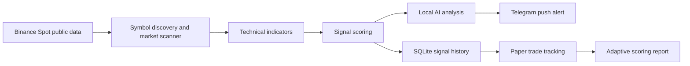

# CryptoRadar

> Backend-only crypto signal intelligence for Binance Spot markets, local AI analysis, and Telegram push alerts.

[](#requirements)
[](#safety-first)
[](#local-ai-analysis)
[](#telegram-push-notifications)

CryptoRadar is a terminal-based crypto market signal bot. It discovers active Binance Spot markets, scans broad token coverage by default, analyzes technical conditions, uses local AI when available, and sends clean Telegram notifications when strong signals appear.

There is no website, no dashboard, and no frontend. CryptoRadar runs from the terminal or as a background service.

## Main Focus

| Focus | What CryptoRadar Does |
| --- | --- |
| Broad token scanning | Discovers active Binance Spot symbols and analyzes nearly every token that passes your quote, volume, and watchlist filters. USDT pairs are enabled by default. |
| Local AI analysis | Uses LM Studio or Ollama locally to reason over market data, indicators, knowledge snippets, and signal history. No cloud AI is required by default. |
| Telegram push alerts | Sends short, mobile-friendly Telegram alerts for eligible BUY, SELL, and HIGH_RISK signals. |
| Learning loop | Tracks signal outcomes, simulated paper trades, broad market data, ML filtering, manual feedback, and adaptive scoring notes. |
| Safety-first design | The bot only analyzes and notifies. It cannot place trades or use Binance trading endpoints. |

## What Makes CryptoRadar Different

CryptoRadar is built as a **proof-first alert engine**, not a hype bot.

| Approach | What Usually Happens | CryptoRadar Difference |
| --- | --- | --- |
| Basic price alert bots | Alert when price crosses a number | Combines trend, volume, indicators, data quality, preferred news, and ML confidence |
| Manual chart watching | Easy to miss fast moves | Watches broad Binance Spot coverage and preferred coins continuously |
| Auto-trading bots | Can place risky orders | Notification-only. No orders, no leverage, no futures, no withdrawals |
| CryptoRadar | Measures before trusting itself | Stores paper trades, backtests signals, compares baselines, and trains a local ML filter from outcomes |

Highlights:

- **Preferred coin intelligence:** `/prefer FOREST` or `/prefer SOLUSDT` starts focused movement, news, and ML breakout monitoring.
- **Telegram-first workflow:** manage preferred coins, holdings, status, ML status, and news from Telegram.
- **Broad ML data collection:** stores major and minor Binance Spot data with quality labels instead of silently ignoring thin coins.
- **Local AI optional:** LM Studio/Ollama can explain signals locally; fixed templates keep alert numbers deterministic.
- **Threshold-based learning:** tiny moves like `+0.1%` are not counted as wins.

## Safety First

CryptoRadar does not trade.

It does not:

- Place buy or sell orders
- Cancel orders
- Withdraw or transfer funds
- Use futures, margin, leverage, or auto-invest
- Require Binance trading API permission
- Connect to Binance trading endpoints

Signals are analysis only. They are not guaranteed profit. You always decide manually.

## How It Works



CryptoRadar watches public Binance Spot market data, calculates indicators, creates signal scores, asks local AI for extra analysis when configured, and then sends only the signals that pass your notification rules.

## What CryptoRadar Can Analyze

- Active Binance Spot pairs
- USDT pairs by default
- High-volume symbols
- Low-volume/minor symbols for ML data collection
- Watchlist symbols
- Top movers
- New listings you add to config
- BTC and ETH market conditions
- Breakouts, breakdowns, pumps, dumps, volume spikes, fake breakout risk, and high-risk moves

The default configuration uses volume and symbol limits so the scanner stays practical. You can widen or narrow coverage in `config.yaml`.

## Broad Data Collection For ML

CryptoRadar separates live alert scanning from broad data collection.

| Layer | Purpose |
| --- | --- |
| Live scanner | Keeps Telegram alerts focused on stronger, higher-quality signals |
| Broad collector | Stores data for active Binance Spot symbols, including minor and low-volume coins |
| Data-quality labels | Marks coins as `good`, `thin`, `low_volume`, or `missing_candles` instead of silently dropping them |
| ML dataset | Uses stored signals and outcomes to build local training examples |

This helps the future ML filter learn from more than only the obvious high-volume winners.

Run broad collection manually:

```powershell
python main.py --collect-market-data-now
python main.py --data-coverage-report
```

By default, broad collection prints progress in PowerShell, stores ticker data for every eligible symbol, and fetches candle data only where it is useful for ML: priority/watchlist symbols and the most liquid coins up to `collector.max_candle_symbols_per_cycle`. If you want candles for every collected symbol, set `collector.fetch_candles: true` in `config.yaml`; if you want ticker-only collection, set it to `false`.

The normal background service can also run the broad collector on its configured interval.

## Local AI Analysis

CryptoRadar supports local AI through:

- LM Studio at `http://localhost:1234/v1`
- Ollama

The AI is used for analysis only. It can help explain why a signal matters, summarize risk, compare indicator support, and include notes from your local knowledge folder.

Telegram alert wording is still produced by fixed code templates. The LLM does not rewrite prices, scores, signal types, or key levels.

Recommended LM Studio config:

```yaml
ai:
  enabled: true
  provider: "lmstudio"
  base_url: "http://localhost:1234/v1"
  model: "qwen/qwen3.5-9b"
  temperature: 0.2
  max_tokens: 500
  timeout_seconds: 15
  reasoning_effort: "none"
  analysis_reasoning_effort: "none"
  analysis_max_tokens: 300
  analysis_timeout_seconds: 3
```

`reasoning_effort` and `analysis_reasoning_effort` stay at `none` by default so live scans do not wait on long model thinking. The analysis timeout is intentionally short; if Qwen does not answer quickly, CryptoRadar keeps the scan moving with fallback analysis. If you want deeper AI commentary later, set `analysis_reasoning_effort` to `low` or `medium` and raise `analysis_timeout_seconds`.

If LM Studio is offline, slow, or returns no visible final answer, CryptoRadar logs the issue and continues with normal scoring and fallback analysis.

Test local AI:

```bash
python main.py --test-ai
```

## Telegram Push Notifications

Telegram is the main alert channel. Alerts are short, structured, and designed for phone screens.

Example alert shape:

```text
BUY SIGNAL - SOLUSDT

Score: 75/100
Confidence: Medium
Risk: Medium
Trend: uptrend

Why this matters:
Breakout with strong relative volume while BTC trend is supportive.

Key levels:
Entry: 140.50-142.50
Invalidation: 137.8
Take-profit: 146, 150

Final:
This is an analysis-based signal, not guaranteed profit. Decide manually.
```

Default notification rules:

| Signal | Default Rule |
| --- | --- |
| BUY | Send when score is 70 or higher |
| SELL | Send when score is 70 or higher |
| HIGH_RISK | Send when score is 65 or higher |
| HOLD, WAIT, AVOID | Do not send by default |

The bot also uses cooldowns and hourly alert limits to reduce spam.

## Quick Start

1. Clone the project.

```bash
git clone https://github.com/Gxmi2006/CryptoRadar.git
cd CryptoRadar
```

2. Create and activate a virtual environment.

Windows:

```bash
python -m venv .venv
.venv\Scripts\activate
```

macOS or Linux:

```bash
python -m venv .venv
source .venv/bin/activate
```

3. Install dependencies.

```bash
pip install -r requirements.txt
```

4. Create your local environment file.

Windows:

```bash
copy .env.example .env
```

macOS or Linux:

```bash
cp .env.example .env
```

5. Run a safe mock scan.

```bash
python main.py --mock --scan-now
```

Mock mode uses fake market data, so it is the safest first test.

## One-Command Automation

Use the automated PowerShell runner when you want CryptoRadar to keep working without typing each command manually.

```powershell
cd "C:\Users\ASUS\Documents\New project 3"
.\scripts\run_cryptoradar.ps1
```

Or run the same automation directly:

```powershell
python main.py --auto-pipeline
```

The auto pipeline continuously:

- scans the market and sends eligible Telegram alerts
- collects broad Binance Spot data for ML
- fetches candle data in smart auto mode
- refreshes paper-trade outcomes during scans
- attempts ML training on its configured interval
- prints periodic PowerShell status lines

If there are not enough labeled win/loss examples yet, ML training waits safely and the rest of the bot keeps running.

When built as `CryptoRadar.exe`, double-clicking the EXE starts the full automation pipeline automatically. The app creates missing `data`, `models`, `logs`, `exports`, `backups`, and `knowledge` folders, initializes SQLite, starts scanner/collector/ML/watchlist/holding/health loops, and sends a Telegram startup message when Telegram is configured.

## Proof Engine And Backtesting

CryptoRadar can test saved candle data locally before you trust a strategy or ML filter.

```powershell
python main.py --backtest
python main.py --signal-quality-report
```

Useful filters:

```powershell
python main.py --backtest --backtest-symbol SOLUSDT
python main.py --backtest --backtest-timeframe 15m --backtest-days 30 --backtest-max-symbols 50
```

The backtester uses only stored SQLite candles. It disables AI and notifications during replay, compares CryptoRadar signals against simple momentum, volume-spike, and random baselines, and reports whether the signals are actually beating simple alternatives.

## One-Coin Movement Alerts

You can check a coin ID directly and get a Telegram-style movement alert.

```powershell
python main.py --coin-alert SOL
python main.py --coin-alert SOLUSDT
```

CryptoRadar resolves `SOL` to the active Binance Spot pair `SOLUSDT`, checks recent candles and 24h ticker data, then reports events such as surge, dump, fast 1h move, volume spike, near 24h high/low, or high-risk pump. If Telegram is enabled, the same message is sent to Telegram.

If a coin is not on normal Binance Spot, CryptoRadar also tries Binance Alpha public data. For example, `FOREST` can resolve to an Alpha trade symbol such as `ALPHA_348USDT` when Binance Alpha exposes it.

Preferred coins get extra attention. When you add a coin with `/prefer`, CryptoRadar checks public crypto RSS feeds for significant matching news and sends only important Telegram alerts. These alerts use first-glance emojis for trend and risk: `🚀` huge surge, `📈` uptrend, `📉` downtrend, `⚠️` risk, `🔥` volume spike, `📰` news, and `🧠` ML breakout context.

News alerts use public RSS by default, no API key:

- CoinDesk RSS
- Cointelegraph RSS

If a trained local ML model exists, preferred alerts include success probability, risk, confidence, and data quality. If not, the alert says ML is still collecting enough labeled examples.

For automatic coin alerts, add symbols to `binance.watchlist_symbols` in `config.yaml` and run:

```powershell
python main.py --auto-pipeline
```

Preferred coins can also be managed from Telegram without editing config.

## Telegram Control Commands

After the app is running, Telegram becomes the control panel:

| Command | Purpose |
| --- | --- |
| `/status` | Show scanner, Telegram, ML, AI, preferred coin, and holdings status |
| `/mlstatus` | Show ML samples, model version, accuracy, and learning state |
| `/prefer SOLUSDT BTCUSDT PEPEUSDT` | Add preferred coins |
| `/unprefer SOLUSDT` | Remove preferred coins |
| `/preferred` | List preferred coins |
| `/clearpreferred` | Clear preferred coins |
| `/news FOREST` | Check latest significant public news plus movement and ML breakout status |
| `/watch SOLUSDT 100 2.5` | Track a holding with entry price and optional amount |
| `/list` | List tracked holdings |
| `/remove SOLUSDT` | Remove a holding |
| `/pause` | Pause scanner/monitor loops |
| `/resume` | Resume scanner/monitor loops |
| `/help` | Show Telegram command help |

Preferred coins are coins you care about. Holdings are coins you already bought. CryptoRadar monitors both, but it still never trades.

## Build The EXE

Build a clean one-file Windows EXE with:

```powershell
cd "C:\Users\ASUS\Documents\New project 3"
.\scripts\build_exe.ps1 -Clean
```

The output will be:

```text
dist\CryptoRadar.exe
```

Copy your private `.env` beside the EXE if you want Telegram enabled. Do not commit `.env`.

## Telegram Setup

1. Open Telegram.
2. Create a bot with BotFather.
3. Put your bot token and chat ID in `.env`.

```bash
TELEGRAM_BOT_TOKEN=
TELEGRAM_CHAT_ID=
```

4. Send a test alert.

```bash
python main.py --test-telegram
```

Do not commit `.env`. It is ignored by Git.

## LM Studio Setup

1. Open LM Studio.
2. Load your Qwen chat or instruct model.
3. Start the local server.
4. Confirm the server URL is `http://localhost:1234/v1`.
5. Set the exact model name in `config.yaml`.

Useful tests:

```bash
python main.py --test-ai
python main.py --test-telegram-format
python main.py --test-live-notification
```

## Knowledge Sources

Add your local research files to the `knowledge/` folder.

Supported files:

| Type | Supported |
| --- | --- |
| PDF | Yes |
| TXT | Yes |
| MD | Yes |
| CSV | Yes |
| JSON | Yes |
| DOCX | Yes |

Rebuild the local knowledge index:

```bash
python main.py --rebuild-knowledge
```

Knowledge sources stay local by default. CryptoRadar stores source quality notes and can reduce trust in sources that repeatedly support weak signals.

## Local ML Filter

CryptoRadar can train a small local ML model from saved signal history. This is not LLM fine-tuning.

The ML model learns from rows like:

- signal type
- score details
- RSI, MACD, relative volume, ATR, and price changes
- BTC and ETH trend context
- data-quality label
- final result: win, loss, or neutral

The model outputs:

- success probability
- risk score
- confidence score
- data-quality warning
- model version

ML is an extra filter only. It does not replace the scoring engine and it never trades.

### ML Success Thresholds

CryptoRadar does not count tiny moves as successful predictions. The default learning rules are:

| Signal Type | Win | Loss | Neutral |
| --- | --- | --- | --- |
| BUY | `+2.5%` or take-profit hit | `-1.5%` or stop/invalidation hit | Anything between after the tracking window |
| SELL warning | `2.0%` favorable drop | `2.0%` adverse rise | Anything between after the tracking window |
| HIGH_RISK warning | `3.0%` favorable drop | `3.0%` adverse rise | Anything between after the tracking window |

For ML training, `win` is the positive class. `loss` and `neutral` are negative classes, so the model learns to filter weak/noisy alerts instead of celebrating tiny moves.

If real win labels are still rare, CryptoRadar warns that accuracy may be inflated by many non-win examples. In that case, use the ML note as a filter only while more market outcomes collect.

Train and inspect the local model:

```powershell
python main.py --train-ml-model
python main.py --ml-report
```

If not enough labeled examples exist, training will stop safely and explain what is missing.

## Common Commands

| Command | Purpose |
| --- | --- |
| `python main.py --auto-pipeline` | Run continuous scanning, collection, learning, and ML automation |
| `python main.py` | Run the live background scanner |
| `python main.py --mock` | Run with simulated market data |
| `python main.py --scan-now` | Run one scan and exit |
| `python main.py --test-telegram` | Send a Telegram test message |
| `python main.py --test-ai` | Test LM Studio local AI |
| `python main.py --test-telegram-format` | Preview the fixed alert template |
| `python main.py --test-live-notification` | Send a fake BUY signal through the real notification path |
| `python main.py --show-config` | Print sanitized config |
| `python main.py --rebuild-knowledge` | Rebuild the local knowledge index |
| `python main.py --collect-market-data-now` | Collect broad Binance Spot data for ML |
| `python main.py --data-coverage-report` | Show data coverage and weak-data symbols |
| `python main.py --coin-alert SOL` | Check one coin ID and send a movement alert |
| `python main.py --backtest` | Replay stored candles and compare CryptoRadar signals with baselines |
| `python main.py --signal-quality-report` | Summarize live results, latest backtest, and ML readiness |
| `python main.py --train-ml-model` | Train the local ML filter from labeled signal history |
| `python main.py --ml-report` | Show ML training and prediction status |
| `python main.py --daily-summary` | Send a daily summary now |
| `python main.py --top-signals` | Show top stored signals |
| `python main.py --learning-report` | Show learning performance |

Manual feedback:

```bash
python main.py --mark-signal SIGNAL_ID win
python main.py --mark-signal SIGNAL_ID loss
python main.py --mark-signal SIGNAL_ID neutral
```

## Configuration Highlights

Edit `config.yaml` to control:

| Area | Important Settings |
| --- | --- |
| Market coverage | `quote_assets`, `min_24h_volume_usdt`, `max_symbols_to_analyze`, `watchlist_symbols` |
| Broad collector | `collector.max_symbols_per_cycle`, `collector.fetch_candles`, `collector.max_candle_symbols_per_cycle`, `collector.interval_minutes` |
| Automation | `automation.auto_train_ml`, `automation.ml_train_interval_minutes`, `automation.status_interval_minutes` |
| Scanner speed | `scan_interval_seconds`, timeframe list |
| Signal thresholds | `buy_score_threshold`, `sell_score_threshold`, `high_risk_threshold` |
| AI | `provider`, `base_url`, `model`, `analysis_reasoning_effort` |
| ML | `ml.min_training_samples`, `ml.random_forest_min_samples`, `ml.model_path` |
| Telegram | token env name, chat ID env name, cooldowns, alert limits |
| Learning | paper-trade tracking, manual feedback, adaptive scoring |

No Binance API key is required for public market monitoring.

## Signal Scores

| Score | Label |
| --- | --- |
| 0-30 | Avoid |
| 31-50 | Weak |
| 51-65 | Watchlist |
| 66-80 | Good signal |
| 81-100 | Strong signal |

BUY scoring considers trend, volume, breakouts, RSI, MACD, EMA alignment, BTC and ETH direction, liquidity, volatility, support and resistance, knowledge-source support, and historical performance.

SELL scoring considers weakening momentum, failed breakouts, support breakdowns, bearish MACD, overbought RSI, sell volume, BTC and ETH weakness, resistance rejection, and previous sell-warning accuracy.

## Learning System

CryptoRadar does not fine-tune the AI model in version 1.

Instead, it learns carefully from:

- Signal history
- Paper-trade tracking
- Manual feedback
- Adaptive scoring weights
- Learning reports

The bot waits for enough completed signals before suggesting scoring changes. This helps avoid overfitting to a few lucky or unlucky trades.

## Paper Trades

Every signal is saved as a simulated paper trade.

| Signal Type | What Gets Tracked |
| --- | --- |
| BUY | Entry zone, take-profit, stop-loss, invalidation, favorable move, drawdown |
| SELL | Whether the warning helped avoid downside |
| HIGH_RISK | Whether the risk warning was useful |
| HOLD | Whether staying neutral was reasonable |

## Requirements

- Python 3.11 or newer
- Internet access for Binance public market data
- Telegram bot token and chat ID for Telegram alerts
- Optional: LM Studio or Ollama for local AI analysis

## Tests

Run tests with:

```bash
pytest
```

The tests cover indicators, scoring, Binance public-data parsing, notification cooldowns, RAG retrieval, prompt safety, paper trades, adaptive scoring, manual feedback, and the rule that no trading execution endpoints exist.

## Runtime Files

CryptoRadar writes runtime data locally:

| File or Folder | Purpose |
| --- | --- |
| `data/cryptoradar.db` | SQLite database |
| `models/latest_model.pkl` | Active local ML model |
| `models/model_reports/` | ML training reports |
| `logs/app.log` | Main app log |
| `logs/signals.log` | Signal log |
| `logs/errors.log` | Error log |
| `logs/learning.log` | Learning log |
| `data/vector_db/` | Local knowledge index |
| `exports/` | Future exports |
| `backups/` | Future backups |

These runtime files are ignored by Git.

## Private Data

Do not commit:

- `.env`
- API tokens
- Telegram chat IDs
- Email passwords
- Personal notes you do not want public
- Runtime database files
- Log files

The included `.gitignore` is set up to keep common secrets and generated files out of GitHub.
